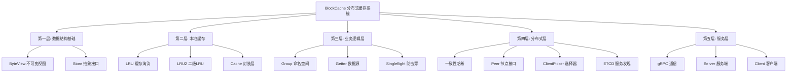

# BlockCache Top-Down Learning Guide
## 从0到1构建分布式缓存系统 - 思维导图式拆解



---

## 第一层：数据结构基础 🧱
> **目标**: 理解缓存中数据是如何存储和访问的

### 1.1 ByteView - 不可变数据视图
**文件**: `byteview.go`

**核心概念**:
- 不可变性 (Immutability) - 防止外部修改缓存数据
- 深拷贝 (Deep Copy) - `cloneBytes()` 确保数据安全
- 接口实现 - 实现 `Value` 接口的 `Len()` 方法

**关键代码**:
```go
type ByteView struct {
    data []byte  // 私有字段，外部无法直接修改
}

func (b ByteView) ByteSlice() []byte {
    return cloneBytes(b.data)  // 返回拷贝，不是原始数据
}
```

**知识点**:
- ✓ Go 的封装 - 小写字段私有化
- ✓ 防御性编程 - 永远返回拷贝而非引用
- ✓ 接口设计 - `Len()`, `ByteSlice()`, `String()`

**新手任务**: 
1. 理解为什么需要拷贝而不是直接返回 `b.data`
2. 尝试去掉 `cloneBytes`，看会发生什么问题

---

### 1.2 Store - 存储抽象层
**目录**: `store/`
**文件**: `store.go`, `lru.go`, `lru2.go`

**核心概念**:
- 接口抽象 - 定义统一的存储接口
- 多种实现 - LRU、LRU2 等不同策略
- 工厂模式 - `NewStore()` 根据类型创建实例

**接口定义**:
```go
type Store interface {
    Get(key string) (Value, bool)
    Set(key string, value Value) error
    Delete(key string) bool
    Clear()
    Len() int
}
```

**两种实现**:

#### LRU (Least Recently Used)
- **数据结构**: 双向链表 + HashMap
- **淘汰策略**: 淘汰最久未使用的
- **时间复杂度**: O(1)
- **适用场景**: 简单缓存

#### LRU2 (Two-Level LRU)
- **数据结构**: 分桶 + 两级LRU
- **特点**: 
  - Level 1: 新数据暂存区
  - Level 2: 热数据区
  - 减少缓存污染
- **适用场景**: 高并发、大规模缓存

**知识点**:
- ✓ 数据结构: 链表、哈希表
- ✓ 算法: LRU 淘汰算法
- ✓ 设计模式: 工厂模式、策略模式
- ✓ 并发控制: 分桶降低锁竞争

**新手任务**:
1. 画出 LRU 的数据结构图
2. 理解 LRU2 为什么需要两层
3. 实现一个简单的 LRU (不考虑并发)

---

## 第二层：本地缓存封装 📦
> **目标**: 构建线程安全、可配置的缓存层

### 2.1 Cache - 缓存封装
**文件**: `cache.go`

**核心概念**:
- **延迟初始化** (Lazy Initialization)
- **并发安全** (Thread Safety)
- **统计信息** (Metrics)
- **生命周期管理** (Lifecycle)

**关键设计**:

#### 延迟初始化
```go
func (c *Cache) ensureInitialized() {
    if atomic.LoadInt32(&c.initialized) == 1 {
        return // 快速路径
    }
    c.mu.Lock()
    defer c.mu.Unlock()
    if c.initialized == 0 {  // 双重检查
        c.store = store.NewStore(...)
        atomic.StoreInt32(&c.initialized, 1)
    }
}
```

**为什么延迟初始化?**
- Group 创建时不知道是否会被使用
- 避免不必要的内存分配
- 支持动态配置

#### 并发安全
- `sync.RWMutex` - 读写锁
- `atomic` 操作 - 原子变量
- 分离读写路径

#### 统计信息
```go
hits   int64  // 命中次数 (原子操作)
misses int64  // 未命中次数
```

**知识点**:
- ✓ 并发编程: RWMutex, atomic
- ✓ 设计模式: 单例模式的延迟初始化
- ✓ 性能优化: 双重检查锁定 (DCL)
- ✓ 监控指标: 命中率计算

**新手任务**:
1. 理解为什么需要双重检查锁定
2. 思考如果去掉 `atomic.LoadInt32` 快速路径会怎样
3. 实现一个简单的统计功能

---

## 第三层：业务逻辑层 🎯
> **目标**: 实现缓存的核心业务逻辑

### 3.1 Group - 缓存组/命名空间
**文件**: `group.go`

**核心概念**:
- **命名空间** - 隔离不同业务的缓存
- **回源机制** - 缓存未命中时如何获取数据
- **防缓存击穿** - Singleflight
- **分布式同步** - 跨节点数据一致性

**架构图**:
```
用户请求
   ↓
Group.Get(key)
   ↓
本地缓存? ───YES──→ 返回
   ↓ NO
从对等节点获取? ───YES──→ 本地缓存 → 返回
   ↓ NO
Getter回源 → 本地缓存 → 返回
```

#### 防缓存击穿 - Singleflight
**问题**: 大量并发请求同一个不存在的key

**解决方案**: Singleflight
```go
ch := g.loader.DoChan(key, func() (any, error) {
    return g.loadData(ctx, key)
})
```

**原理**: 
- 第一个请求执行加载
- 后续相同key的请求等待第一个结果
- 避免重复加载

### 3.2 Getter - 数据源接口
**核心概念**:
- **回调函数** - 用户定义如何获取数据
- **函数类型实现接口** - Go 的优雅设计

```go
type Getter interface {
    Get(ctx context.Context, key string) ([]byte, error)
}

type GetterFunc func(ctx context.Context, key string) ([]byte, error)

func (f GetterFunc) Get(ctx context.Context, key string) ([]byte, error) {
    return f(ctx, key)  // 函数调用自己
}
```

**使用示例**:
```go
group := NewGroup("users", 1<<20, 
    GetterFunc(func(ctx context.Context, key string) ([]byte, error) {
        return db.Query("SELECT * FROM users WHERE id=?", key)
    }),
)
```

### 3.3 分布式同步
**核心方法**:
- `Set(ctx, key, value)` - 设置并同步到对等节点
- `Delete(ctx, key)` - 删除并同步
- `syncToPeers` - 异步同步到其他节点

**防止广播风暴**:
```go
isPeerRequest := ctx.Value("from_peer") != nil
if !isPeerRequest && g.peers != nil {
    go g.syncToPeers(ctx, "set", key, value)
}
```

**知识点**:
- ✓ 设计模式: 策略模式 (Getter), 观察者模式 (同步)
- ✓ 并发控制: Singleflight, Context
- ✓ 分布式概念: 数据一致性, 广播风暴
- ✓ Go 特性: 函数类型实现接口

**新手任务**:
1. 理解 `GetterFunc` 如何实现接口
2. 画出缓存击穿的场景
3. 思考如果不防止广播风暴会发生什么

---

## 第四层：分布式层 🌐
> **目标**: 实现节点发现和数据分布

### 4.1 一致性哈希
**目录**: `consistenthash/`
**文件**: `con_hash.go`, `config.go`

**核心概念**:
- **虚拟节点** - 提高数据分布均匀性
- **哈希环** - 环形数据结构
- **动态负载均衡** - 根据负载调整虚拟节点数量

**数据结构**:
```go
type Map struct {
    keys     []int            // 有序哈希环
    hashMap  map[int]string   // 哈希值 → 节点
    nodeReplicas map[string]int // 节点 → 虚拟节点数
    nodeCounts   map[string]int64 // 负载统计
}
```

**查找流程**:
```
key → hash(key) → 二分查找最近的虚拟节点 → 映射到真实节点
```

**动态调整**:
- 定期检测各节点负载
- 负载高的节点减少虚拟节点
- 负载低的节点增加虚拟节点

### 4.2 服务发现 - ETCD
**目录**: `registry/`
**文件**: `register.go`

**核心概念**:
- **服务注册** - 节点启动时注册到 etcd
- **租约机制** (Lease) - 心跳保活
- **Watch 机制** - 监听节点变化

**注册流程**:
```go
// 1. 创建租约 (10秒TTL)
lease, err := cli.Grant(ctx, 10)

// 2. 注册服务
key := "/services/" + svcName + "/" + addr
cli.Put(ctx, key, addr, clientv3.WithLease(lease.ID))

// 3. 保持租约
keepAliveCh, _ := cli.KeepAlive(ctx, lease.ID)
```

**监听变化**:
```go
watchChan := watcher.Watch(ctx, "/services/"+svcName, clientv3.WithPrefix())
for resp := range watchChan {
    for _, event := range resp.Events {
        switch event.Type {
        case EventTypePut:    // 节点上线
        case EventTypeDelete: // 节点下线
        }
    }
}
```

### 4.3 Peer & ClientPicker
**文件**: `peers.go`

**接口定义**:
```go
// Peer - 单个节点能力
type Peer interface {
    Get(ctx, group, key string) ([]byte, error)
    Set(ctx, group, key, value) error
    Delete(group, key) (bool, error)
    Close() error
}

// PeerPicker - 选择节点
type PeerPicker interface {
    PickPeer(key string) (peer Peer, ok bool, self bool)
    Close() error
}
```

**ClientPicker 组件**:
- `consHash` - 一致性哈希
- `clients` - 节点连接池
- `etcdCli` - 服务发现客户端

**知识点**:
- ✓ 分布式算法: 一致性哈希
- ✓ 服务发现: etcd, 租约, Watch
- ✓ 设计模式: 工厂模式 (ClientPicker)
- ✓ 负载均衡: 动态调整

**新手任务**:
1. 画出一致性哈希环的示意图
2. 理解虚拟节点如何提高均匀性
3. 实现一个简单的哈希环 (不考虑虚拟节点)

---

## 第五层：RPC 通信层 📡
> **目标**: 实现节点间的 gRPC 通信

### 5.1 Protobuf 定义
**文件**: `pb/blockcache.proto`

```protobuf
service BlockCache {
  rpc Get(Request) returns (ResponseForGet);
  rpc Set(Request) returns (ResponseForGet);
  rpc Delete(Request) returns (ResponseForDelete);
}

message Request {
  string group = 1;
  string key = 2;
  bytes value = 3;
}
```

**生成代码**:
```bash
protoc --go_out=. --go-grpc_out=. pb/blockcache.proto
```

### 5.2 Server - gRPC 服务端
**文件**: `server.go`

**核心功能**:
- 启动 gRPC 服务
- 注册到 etcd
- 实现 RPC 方法

**启动流程**:
```go
// 1. 创建 gRPC 服务器
srv := grpc.NewServer(opts...)

// 2. 注册服务
pb.RegisterBlockCacheServer(srv, s)

// 3. 监听端口
lis, _ := net.Listen("tcp", addr)
srv.Serve(lis)

// 4. 注册到 etcd
registry.Register(svcName, addr, stopCh)
```

### 5.3 Client - gRPC 客户端
**文件**: `client.go`

**核心功能**:
- 连接到远程节点
- 调用 RPC 方法
- 实现 Peer 接口

**连接流程**:
```go
conn, err := grpc.DialContext(ctx, addr,
    grpc.WithTransportCredentials(insecure.NewCredentials()),
    grpc.WithBlock(),
    grpc.WithDefaultCallOptions(grpc.WaitForReady(true)),
)
grpcClient := pb.NewBlockCacheClient(conn)
```

**知识点**:
- ✓ RPC 框架: gRPC, Protobuf
- ✓ 网络编程: TCP, 连接管理
- ✓ 序列化: Protocol Buffers
- ✓ 服务治理: 健康检查, 超时控制

**新手任务**:
1. 理解 Protobuf 如何定义消息
2. 学习 gRPC 的基本概念
3. 尝试用 curl 或 grpcurl 调用服务

---

## 学习路径建议 🎓

### 阶段一：基础 (1-2周)
1. ✅ 实现 `ByteView` - 理解不可变性
2. ✅ 实现 `LRU` - 掌握数据结构
3. ✅ 实现 `Cache` - 学习并发控制

### 阶段二：进阶 (2-3周)
4. ✅ 实现 `Group` - 理解业务逻辑
5. ✅ 实现 `Singleflight` - 防止缓存击穿
6. ✅ 实现 `Getter` - 理解回调机制

### 阶段三：分布式 (3-4周)
7. ✅ 实现一致性哈希 - 理解分布式算法
8. ✅ 集成 etcd - 学习服务发现
9. ✅ 实现 `ClientPicker` - 节点管理

### 阶段四：通信 (2-3周)
10. ✅ 学习 Protobuf - 定义接口
11. ✅ 实现 gRPC Server - 服务端
12. ✅ 实现 gRPC Client - 客户端

### 阶段五：测试 (1-2周)
13. ✅ 单元测试 - 覆盖核心逻辑
14. ✅ 集成测试 - 多节点场景
15. ✅ 压力测试 - 性能验证

---

## 核心知识点总结 📚

### Go 语言特性
- ✓ 接口设计与实现
- ✓ 并发编程 (goroutine, channel, mutex, atomic)
- ✓ 函数类型实现接口
- ✓ Context 传递与超时控制
- ✓ 包管理与模块化

### 数据结构与算法
- ✓ 链表、哈希表
- ✓ LRU 算法
- ✓ 一致性哈希
- ✓ 二分查找

### 分布式系统
- ✓ 服务发现 (etcd)
- ✓ 一致性哈希
- ✓ RPC 通信 (gRPC)
- ✓ 数据一致性
- ✓ 缓存击穿、穿透、雪崩

### 设计模式
- ✓ 工厂模式
- ✓ 策略模式
- ✓ 单例模式
- ✓ 观察者模式

### 性能优化
- ✓ 延迟初始化
- ✓ 读写分离
- ✓ 分桶降低锁竞争
- ✓ 原子操作避免锁

---

## 常见问题 FAQ ❓

### Q1: 为什么需要 ByteView?
**A**: 防止外部修改缓存数据，确保数据安全。如果直接返回 `[]byte`，外部可以修改它，导致缓存中的数据被污染。

### Q2: LRU 和 LRU2 的区别?
**A**: LRU2 有两级缓存，新数据先进 Level1，访问频繁才进 Level2。这样可以防止偶尔的大量访问污染热数据区。

### Q3: 什么是缓存击穿?
**A**: 大量并发请求同一个不存在的key，导致所有请求都打到数据库。Singleflight 确保只有一个请求去加载数据。

### Q4: 为什么用一致性哈希?
**A**: 节点增减时，只需要重新分配部分数据，而不是全部数据。虚拟节点进一步提高了数据分布的均匀性。

### Q5: Context 有什么用?
**A**: 
- 传递请求范围的值 (如 `from_peer` 标记)
- 控制超时
- 取消操作
- 跨 goroutine 传递信号

---

## 下一步 🚀

1. **阅读源码** - 按上述顺序逐层理解
2. **动手实践** - 每个模块都尝试自己实现
3. **运行测试** - 理解各个场景
4. **性能调优** - 尝试不同配置
5. **扩展功能** - 添加监控、日志、更多缓存策略

**推荐资源**:
- Go 并发编程: [Go Concurrency Patterns](https://go.dev/blog/pipelines)
- 分布式系统: [Designing Data-Intensive Applications](https://dataintensive.net/)
- gRPC: [gRPC 官方文档](https://grpc.io/docs/)
- Consistent Hashing: [论文原文](https://en.wikipedia.org/wiki/Consistent_hashing)
